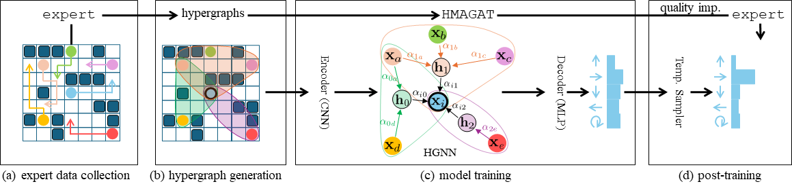

# Pairwise is Not Enough: Hypergraph Neural Networks for Multi-Agent Pathfinding
[](https://arxiv.org/abs/2602.06733)
[](#)
[](LICENSE)

This is the code repository for the paper ["Pairwise is Not Enough: Hypergraph Neural Networks for Multi-Agent Pathfinding"](https://arxiv.org/abs/2602.06733) introducing HMAGAT, Hypergraph Multi-Agent Attention Network, a hypergraph neural network for multi-agent pathfinding (MAPF). The paper has been accepted at ICLR 2026.



## Structure Overview
Parts of the algorithm implementations are taken from the [POGEMA Benchmark](https://github.com/Cognitive-AI-Systems/pogema-benchmark)
and are detailed in `pogema_benchmark/README.md`. We also take the PIBT algorithm implementation from
[PyPIBT](https://github.com/Kei18/pypibt), as detailed
in `pibt/pypibt/README.md`. SSIL implementation has been taken from the [ML-MAPF-with-Search](https://github.com/Rishi-V/ML-MAPF-with-Search)
repository. The code for MAPF-GPT has been taken from
[MAPF-GPT](https://github.com/CognitiveAISystems/MAPF-GPT).

```plaintext
├── checkpoints
|      Checkpoints for HMAGAT and MAGAT models.
├── dcc
|      Code for DCC solver (from pogema-benchmark).
├── docker
|      Contains relevant dockerfile for running the code.
├── gpt
|      Code for MAPF-GPT, also includes PIBT collision shielding.
├── hmagat
|      Our code for HMAGAT (and MAGAT) training.
├── lacam
|      Code for LaCAM3 (from pogema-benchmark).
├── magat
|      Contains license for the MAGAT code, which we build upon.
├── pibt
|      Code for PIBT (from PyPIBT).
├── pogema_benchmark
├── pyamg
|      PyAMG code, which includes code for Lloyd's algorithm on graphs.
├── scrimp
|      Code for SCRIMP (from pogema-benchmark).
├── ssil
|      Code for SSIL (from ML-MAPF-with-Search).
|
├── grid_config_generator.py
|      Generates grid configs for testing and training.
├── README.md
├── test_expert.py
|      Testing code for other experts (i.e. models other than HMAGAT and MAGAT).
└── test_imitation_learning_pyg.py
       Testing code for HMAGAT (and MAGAT).
```

## Usage
The easiest way to train and test the models is to use the provided `docker/dockerfile`.
The docker file is based on the one provided by pogema-benchmark. We also provide
`docker/dockerfile_ssil` to run the SSIL evaluation.

## HMAGAT
HMAGAT is a hypergraph attention network for MAPF. We base it on MAGAT
by [Li et. al.](https://arxiv.org/abs/2011.13219). We include the dataset generation
and training code for HMAGAT in `hmagat/` directory.
The CNN encoding definition and parts of
the model definition in `hmagat/modules/agents.py` are taken from the implementation of
[MAGAT](https://github.com/proroklab/magat_pathplanning). We include the LICENSE
from the forementioned repository at `magat/LICENSE`.
Below we provide an overview of the directory:

```plaintext
├── hmagat
|   ├── additional_data
|   |      Cost-to-go matrix generation.
|   |
|   ├── hypergraph_gen_strategies
|   |      Implementations of the hypergraph generators.
|   |
|   ├── modules
|   |   ├── model
|   |   |      HGNN and GNN definitions.
|   |   ├── temperature_sampling
|   |   |      Temperature sampling module definition -- Actor-Critic model and PPO-based loss.
|   |   └── agents.py
|   |          Model definition.
|   |
|   ├── collision_shielding.py
|   |      Code to allow naive or PIBT collision shielding for the model.
|   ├── convert_to_imitation_dataset.py
|   |      Converts raw expert prediction to graph based format.
|   ├── dataset_loading.py
|   ├── generate_additional_data.py
|   |      Generates any additional input dataset, like cost-to-go matrix, greedy actions, history.
|   ├── generate_expert_makespans.py
|   |      Code to calculate the makespans of expert solutions (for Quality Imp. Training).
|   ├── generate_hypergraphs.py
|   |      Code to generate hypergraphs for collected trajectories.
|   ├── generate_pos.py
|   |      Code to generate the agent position dataset (for edge features).
|   ├── generate_target_vec.py
|   ├── imitation_dataset_pyg.py
|   |      Dataset definition for the torch geometric hypergraphs and graphs.
|   ├── loss.py
|   ├── lr_scheduler.py
|   ├── post_train_quality_imp.py
|   |      Code for the post-training finetuning for solution quality improvement,
|   |      based on on-demand dataset aggregation.
|   ├── run_expert.py
|   |      Code to generate the raw expert predictions.
|   ├── runtime_data_generation.py
|   |      Unifying code to take environment observations and produce hypergraph (or graph) data.
|   ├── temperature_training.py
|   |      Trains HMAGAT's temperature sampling module.
|   ├── train_imitation_learning_pyg.py
|   |      Main HMAGAT training loop.
|   ├── training_args.py
|   └── utils.py
└── test_imitation_learning_pyg.py
       Code to test the trained model.
```

### Dataset Generation
The dataset generation first involves collection of expert trajectories and then extracting/generating
relevant features from them. We note below the commands to generate the dataset used by the HMAGAT
model in the paper. Please update `/path/to/dataset` with the appropriate path.

```sh
python -m hmagat.run_expert --dataset_dir /path/to/dataset --obs_radius 5 --num_samples 30000 --save_termination_state --expert_algorithm LaCAM --obstacle_density_max 0.7 --ensure_grid_config_is_generatable
```

This can then we converted to an imitation learning dataset.

```sh
python -m hmagat.convert_to_imitation_dataset --dataset_dir /path/to/dataset --obs_radius 5 --num_samples 30000 --save_termination_state --expert_algorithm LaCAM --obstacle_density_max 0.7 --ensure_grid_config_is_generatable --use_lists
```

We can then generate hypergraphs for the collected dataset.

```sh
python -m hmagat.generate_hypergraphs --dataset_dir /path/to/dataset --obs_radius 5 --num_samples 30000 --save_termination_state --expert_algorithm LaCAM --obstacle_density_max 0.7 --ensure_grid_config_is_generatable --hypergraph_comm_radius 7 --hyperedge_generation_method kmeans --hypergraph_num_updates 10 --hypergraph_wait_one --hypergraph_initial_colperc 0.1 --hypergraph_final_colperc 0.1 
```

Normalized cost-to-go features can be generated for the dataset as below.

```sh
python -m hmagat.generate_additional_data --dataset_dir /path/to/dataset --obs_radius 5 --num_samples 30000 --save_termination_state --expert_algorithm LaCAM --add_data_cost_to_go --normalize_cost_to_go --obstacle_density_max 0.7 --ensure_grid_config_is_generatable --clamp_cost_to_go 1.0
```

For the relative position-based edge features, we also generate the positional data.

```sh
python -m hmagat.generate_pos --dataset_dir /path/to/dataset --obs_radius 5 --num_samples 30000 --save_termination_state --expert_algorithm LaCAM --obstacle_density_max 0.7 --ensure_grid_config_is_generatable --use_edge_attr --use_lists
```

### Training
The HMAGAT model can be trained on the previously generated dataset, by appropriately replacing the `/path/to/dataset`
and `/path/to/checkpoints` values below.

```sh
python -m hmagat.train_imitation_learning_pyg --dataset_dir /path/to/dataset --obs_radius 5 --num_samples 30000 --save_termination_state --expert_algorithm LaCAM --obstacle_density_max 0.7 --ensure_grid_config_is_generatable --hypergraph_comm_radius 7 --hyperedge_generation_method kmeans --hypergraph_num_updates 10 --hypergraph_wait_one --hypergraph_initial_colperc 0.1 --hypergraph_final_colperc 0.1 --add_data_cost_to_go --normalize_cost_to_go --clamp_cost_to_go 1.0 --use_lists --checkpoints_dir /path/to/checkpoints/hmagat_pre_finetune --run_name hmagat_pre_finetune --device -1 --run_online_expert --imitation_learning_model DirectionalHMAGAT --hyperedge_feature_generator magat --final_feature_generator magat --model_residuals all --use_edge_attr --use_edge_attr_for_messages positions+manhattan --edge_attr_cnn_mode MLP --load_positions_separately --train_on_terminated_agents --recursive_oe --cnn_mode ResNetLarge_withMLP --no-run_expert_in_separate_fork --oe_improve_quality --oe_improve_quality_expert LaCAM-withMaxSteps-1-2-10 --collision_shielding naive --action_sampling probabilistic
```

We can then perform post-training quality improvement finetuning as below:

```sh
python -m hmagat.post_train_quality_imp --dataset_dir /path/to/dataset --obs_radius 5 --num_samples 30000 --save_termination_state --expert_algorithm LaCAM --obstacle_density_max 0.7 --ensure_grid_config_is_generatable --hypergraph_comm_radius 7 --hyperedge_generation_method kmeans --hypergraph_num_updates 10 --hypergraph_wait_one --hypergraph_initial_colperc 0.1 --hypergraph_final_colperc 0.1 --add_data_cost_to_go --normalize_cost_to_go --clamp_cost_to_go 1.0 --use_lists --checkpoints_dir /path/to/checkpoints/hmagat --run_name hmagat --device -1 --run_online_expert --imitation_learning_model DirectionalHMAGAT --hyperedge_feature_generator magat --final_feature_generator magat --model_residuals all --use_edge_attr --use_edge_attr_for_messages positions+manhattan --edge_attr_cnn_mode MLP --load_positions_separately --train_on_terminated_agents --recursive_oe --cnn_mode ResNetLarge_withMLP --collision_shielding naive --action_sampling probabilistic --no-run_expert_in_separate_fork --oe_improve_quality --oe_improve_quality_expert LaCAM-withMaxSteps-1-2-10 --pretrain_weights_path /path/to/checkpoints/hmagat_pre_finetune/best.pt --lr_start 1e-4 --oe_improve_quality_threshold 0.94
```

Finally, we train the RL-based temperature sampling module.

```sh
python -m hmagat.temperature_training.py --dataset_dir /path/to/dataset --obs_radius 5 --num_samples 100 --save_termination_state --expert_algorithm LaCAM --obstacle_density_min 0.4 --obstacle_density_max 0.7 --num_agents 32+64 --ensure_grid_config_is_generatable --max_episode_steps 256 --hypergraph_comm_radius 7 --hyperedge_generation_method kmeans --hypergraph_num_updates 10 --hypergraph_wait_one --hypergraph_initial_colperc 0.1 --hypergraph_final_colperc 0.1 --add_data_cost_to_go --normalize_cost_to_go --clamp_cost_to_go 1.0 --use_lists --checkpoints_dir /path/to/checkpoints/hmagat --run_name hmagat --device -1 --run_online_expert --imitation_learning_model DirectionalHMAGAT --hyperedge_feature_generator magat --final_feature_generator magat --model_residuals all --use_edge_attr --use_edge_attr_for_messages positions+manhattan --edge_attr_cnn_mode MLP --load_positions_separately --train_on_terminated_agents --recursive_oe --cnn_mode ResNetLarge_withMLP --no-run_expert_in_separate_fork --oe_improve_quality --oe_improve_quality_expert LaCAM-withMaxSteps-1-2-10 --collision_shielding pibt --action_sampling probabilistic --rl_based_temperature_sampling --temperature_checkpoints_dir /path/to/checkpoints/hmagat_temperature_module --temperature_run_name simple_rl --temperature_actor_critic simple-local-val-init --temperature_optimize only-all-on-goal --iterations_per_epoch 3 --temperature_min_val 0.5 --temperature_max_val 1.0 --num_epochs 100
```

## Evaluation
The trained HMAGAT model can be evaluation using `test_imitation_learning_pyg.py`.
Below we provide a sample command to run tests over a dense warehouse map with 128 agents, using the provided
checkpoints.

```sh
python test_imitation_learning_pyg.py --obs_radius 5 --save_termination_state --hypergraph_comm_radius 7 --hyperedge_generation_method kmeans --hypergraph_num_updates 10 --hypergraph_wait_one --hypergraph_initial_colperc 0.1 --hypergraph_final_colperc 0.1 --add_data_cost_to_go --normalize_cost_to_go --clamp_cost_to_go 1.0 --use_lists --checkpoints_dir checkpoints/hmagat --run_name hmagat --device -1 --run_online_expert --imitation_learning_model DirectionalHMAGAT --hyperedge_feature_generator magat --final_feature_generator magat --model_residuals all --use_edge_attr --use_edge_attr_for_messages positions+manhattan --edge_attr_cnn_mode MLP --load_positions_separately --train_on_terminated_agents --recursive_oe --cnn_mode ResNetLarge_withMLP --rl_based_temperature_sampling --temperature_checkpoints_dir checkpoints/hmagat_temperature_module --temperature_run_name simple_rl --temperature_actor_critic simple-local-val-init --temperature_optimize only-all-on-goal --temperature_sampling_model_epoch_num 43 --collision_shielding pibt --action_sampling probabilistic --test_name dense_warehouse_128 --test_num_samples 128 --test_obs_radius 5 --test_map_types warehouse=1.0 --test_num_agents 128+128 --test_wall_width_min 8 --test_wall_width_max 8 --test_vertical_gap 1 --test_num_wall_rows_min 5 --test_num_wall_rows_max 5 --test_num_wall_cols_min 2 --test_num_wall_cols_max 2 --test_side_pad 3 --test_max_episode_steps 512 --test_min_dist 10
```

MAPF-GPT (85M) can be run on the same dense warehouse instances using the below command.

```sh
python test_expert.py --expert_algorithm MAPF-GPT-PIBT-85M --set_expert_time_limit 60 --test_name dense_warehouse_128 --num_samples 128 --obs_radius 5 --map_types warehouse=1.0 --num_agents 128+128 --wall_width_min 8 --wall_width_max 8 --vertical_gap 1 --num_wall_rows_min 5 --num_wall_rows_max 5 --num_wall_cols_min 2 --num_wall_cols_max 2 --side_pad 3 --max_episode_steps 512 --min_dist 10
```

## Algorithms
Below we note each pre-existing algorithm included, with the links to the original repositories.

| Algorithm  | Link |
|-----------|------|
| DCC       | [https://github.com/ZiyuanMa/DCC](https://github.com/ZiyuanMa/DCC) |
| LaCAM3    | [https://github.com/Kei18/lacam3](https://github.com/Kei18/lacam3) |
| MAGAT     | [https://github.com/proroklab/magat_pathplanning](https://github.com/proroklab/magat_pathplanning) |
| MAPF-GPT  | [https://github.com/CognitiveAISystems/MAPF-GPT](https://github.com/CognitiveAISystems/MAPF-GPT) |
| PIBT      | [https://github.com/Kei18/pypibt](https://github.com/Kei18/pypibt) |
| SCRIMP    | [https://github.com/marmotlab/SCRIMP](https://github.com/marmotlab/SCRIMP) |
| SSIL      | [https://github.com/Rishi-V/ML-MAPF-with-Search](https://github.com/Rishi-V/ML-MAPF-with-Search) |

## Citation

```bibtex
@article{jain2026hmagat,
  title={Pairwise is Not Enough: Hypergraph Neural Networks for Multi-Agent Pathfinding},
  author={Jain, Rishabh and Okumura, Keisuke and Amir, Michael and Liò, Pietro and Prorok, Amanda},
  year={2026},
  journal={arXiv preprint arxiv:2602.06733}
}
```